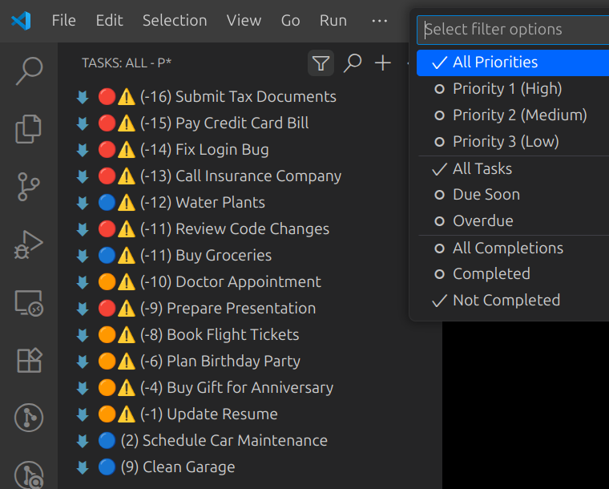

# Tasks - VSCode Extension

A minimalist task management extension for VSCode that helps you organize and track tasks directly within your markdown files using a simple hashtag system. 

**Examples:**
- `🔴 (1) Finish quarterly report` - Due tomorrow
- `🟠 (5) Review meeting notes` - Due in 5 days  
- `🔴⚠️ (-2) Update budget` - 2 days overdue
- `🟠 (0) Fix login bug` - Due today
- `🔴 (?) Plan vacation` - No due date specified
- `✅ (-5) Completed presentation` - Completed task (5 days past due date)

A `Task` is simply some action that needs to be done in the future and optionally has a due-date and priority. Each task consists of just a markdown file. Any markdown file that contains the hashtag `#task` is automatically considered as a `Task` by this extension, and will show up in the Extension's Tasks Panel. You can optionally include a timestamp formatted like `[MM/DD/YYYY HH:MM:SS AM/PM]` (or `[MM/DD/YYYY]`) to specify a due date. 



## Overview (how it works)

Tasks scans your workspace for markdown files containing task markers and due dates, then displays them in an organized, filterable list. Tasks are automatically sorted chronologically by due date and include visual indicators for overdue items.

## Features

- **Automatic Task Detection**: Scans all `.md` files in your workspace
- **Smart Filtering**: Unified filter menu with priority and view options
- **Task Search**: Find tasks by searching both filenames and file content
- **Visual Indicators**: Emoji icons show task status at a glance
- **Relative Date Display**: Shows "Due tomorrow" instead of raw timestamps
- **Task Completion**: Mark tasks as done to hide them from all views
- **Easy Timestamp Insertion**: Right-click to insert properly formatted due dates

## How to Use

### Creating Tasks

**Quick Method**: Click the **+** button in the Tasks panel header to instantly create a new task file that's ready to edit.

**Manual Method**: To create a task manually, your markdown file must contain:

1. **Task marker**: `#task` hashtag anywhere in the file
2. **Due date** (optional): A timestamp in the format `[MM/DD/YYYY HH:MM:SS AM/PM]`
3. **File extension**: Must be a `.md` (markdown) file

If no timestamp is provided, the task will be treated as a low-priority, far-future task.

**Example task file:**
```markdown
# Project Planning

Need to finish the quarterly report #task

## Due Date
[09/15/2025 05:00:00 PM]

## Notes
- Include sales figures
- Review with team lead
```

*Note that the only important thing about the above example markdown file is that it contains `#task` (making the entire file considered to be a definition of a task). The formatted timestamp is optional but allows you to specify a due date in the specific format shown.*

#### Simple Task Files Using Filename as Description

For a cleaner workflow, you can create minimal task files where **the filename itself becomes the task description**. This works when your markdown file contains only one non-empty line that starts with either `#` or `[`.

**Example:**
- **Filename**: `Fix-login-bug.md`
- **File contents**: `#task [09/15/2025 05:00:00 PM]` (or just `#task`)
- **Result**: Task appears as "Fix login bug" in the panel

This is perfect for simple tasks where you don't need additional notes or content - just create a descriptively named file with the task marker and timestamp, and the filename (without the .md extension) will be used as the task description.

### Configuration

The extension supports the following configuration options (accessible via VSCode Settings):

- **`task-manager.newTaskFolder`**: Specifies the folder where new task files are created when using the + button
  - **Type**: String
  - **Default**: `""` (workspace root)
  - **Example values**: `"tasks"`, `"todo"`, `"projects/tasks"`
  - **Note**: Folder path is relative to workspace root. The folder will be created automatically if it doesn't exist.

To access settings:
1. Open VSCode Settings (File → Preferences → Settings, or Ctrl+Shift+P then type "Preferences: Open Settings")
2. Search for "task manager" (not just "tasks" to avoid VSCode's built-in task settings)
3. Look for "New Task Folder" under the "Task Manager" section
4. Configure the folder path as needed

### Supported Hashtags

- **`#task`** - Marks a file as containing a task (required)
- **`#done`** - Marks a task as completed (shows checkmark ✅ icon, hidden by default but can be viewed with completion filters)
- **`#p1, #p2, #p3`** - High(1), Medium(2), and Low(3) priproty

### GUI Elements

#### Activity Bar Icon
- **Location**: Left sidebar activity bar
- **Icon**: Checklist symbol
- **Function**: Opens the Tasks panel

#### Task Panel
- **Location**: Left sidebar (when Tasks is active)
- **Title**: Shows current filter combination (e.g., "All Tasks", "Due Soon - P1", "Overdue - P2")
- **Content**: List of tasks with relative due dates and status icons

#### Filter Menu
See the unified Filtering & Search section below for full details; the filter (funnel) icon in the view title opens the filter picker.

#### Search Button
- **Location**: Tasks panel header (🔍 magnifying glass icon)
- **Function**: Search through task filenames and content
- **Usage**: 
  - Click the search icon to open the search input dialog
  - Enter any text to search for (searches are case-insensitive)
  - Results show all tasks whose **filenames** or **file content** contain the search text
  - To clear search results, click the search icon again and submit an empty search
  - The panel title shows your search query (e.g., "SEARCH - P* - 'bug'")
  - Any other filter action (using the filter menu) automatically clears the search

**Search Examples:**
- Search for `"bug"` - finds files named `fix-login-bug.md` or files containing the word "bug"
- Search for `"review"` - finds any task with "review" in the filename or content
- Search for `"2025"` - finds tasks with "2025" in their timestamps or content

This feature is perfect for quickly finding specific tasks in large workspaces without having to browse through all tasks manually.

#### New Task Button
- **Location**: Tasks panel header (+ icon)
- **Function**: Creates a new task file with one click
- **Behavior**: 
  - Generates a new file named `task-001.md`, `task-002.md`, etc. (auto-increments)
  - Places file in the configured task folder (or workspace root if not configured)
  - Pre-fills with `#task [current timestamp] #p3` format
  - Automatically opens the new file for editing
  - Refreshes the Tasks panel to show the new task

This is the quickest way to create a new task - just click the + button and start typing your task description!

**Configuring Task Folder**: You can specify where new task files are created by setting the `task-manager.newTaskFolder` configuration. Go to VSCode settings (File → Preferences → Settings) and search for "task manager" to find the "New Task Folder" setting. Enter a folder path relative to your workspace root (e.g., "tasks", "todos", or "project/tasks"). Leave empty to create tasks in the workspace root.

#### Right-Click Context Menu

**In Text Editor:**
- **Location**: Any text editor
- **Option**: "Insert Timestamp"
- **Function**: Inserts current date/time in the required format at cursor position

**In Tasks Panel:**
- **Location**: Right-click on any task in the Tasks panel
- **Options Available**:
  - **Date Extension Commands**: +Day, +Week, +Month, +Year (for tasks with timestamps)
  - **Delete Task**: Permanently removes the task file from your workspace
  - **About**: Shows extension information

**Delete Task Feature:**
- Right-click any task in the Tasks panel and select "Delete Task"
- Shows a confirmation dialog before deletion
- Permanently removes the markdown file from your workspace
- Automatically refreshes the Tasks panel after deletion
- **Warning**: This action cannot be undone - the file will be permanently deleted

### Task Display Format

Tasks appear in the panel with a compact format showing days until due date in parentheses:
```
[emoji] ([days]) [task description]
```

The days indicator shows:
- **Positive numbers**: Days until due date (e.g., `(5)` = due in 5 days)
- **Zero**: Due today (`(0)`)
- **Negative numbers**: Days overdue (e.g., `(-3)` = 3 days overdue)
- **Question mark**: No due date specified (`(?)`)

The task description is either:
- The first non-blank line from the file (with leading # symbols removed), OR
- The filename (without .md extension) if the file contains only a task marker and/or timestamp

**Examples:**
- `� (1) Finish quarterly report` - Due tomorrow
- `� (5) Review meeting notes` - Due in 5 days  
- `🔴⚠️ (-2) Update budget` - 2 days overdue
- `� (0) Fix login bug` - Due today
- `🔴 (?) Plan vacation` - No due date specified

### Filtering & Search

The Tasks panel offers a single unified filtering system plus search to refine what you see. All functionality related to filtering and searching is documented here (nowhere else) for simplicity.

#### Overview
- Open the filter picker via the filter (funnel) icon (one active choice per group; groups combine).
- Open search via the 🔍 icon (search text combines with the currently selected filters until cleared).
- Panel title shows current state (e.g., `Due Soon - P1`, or `SEARCH - P* - 'bug'`).

#### Filter Groups (10 Options Total)
1. (Priority) All Priorities – show every priority level
2. (Priority) Priority 1 (High) – `#p1` or no priority tag
3. (Priority) Priority 2 (Medium) – `#p2`
4. (Priority) Priority 3 (Low) – `#p3`
5. (View) All Tasks – no due-date restriction
6. (View) Due Soon – due in next 3 days OR already overdue
7. (View) Overdue – past due date only (⚠️ shown)
8. (Completion) All Completions – completed + not completed
9. (Completion) Completed – contains `#done`
10. (Completion) Not Completed – no `#done` (default)

#### Using Filters
1. Click the filter (funnel) icon and pick one option in any group; previous selection in that group is replaced.
2. Combine one selection from each group for precise views (e.g., High + Due Soon + Not Completed).
3. Changing filters clears any active search automatically.
4. Overdue tasks always show the warning icon ⚠️; they also appear in Due Soon (by design).

#### Search
| Aspect | Behavior |
|--------|----------|
| Trigger | Click 🔍 icon |
| Scope | Case-insensitive match in filenames and file content |
| Interaction with Filters | Search results are still constrained by active filters |
| Clearing | Run search with empty input OR change any filter |
| Performance | Uses in-memory task data (no full rescan) |

##### Effective Search Use-Cases
- Locate tasks by keyword (client, feature, bug ID)
- Narrow to a sprint window by searching a date fragment (e.g., `2025/09`)
- Combine with Priority 1 to focus critical items containing a term

#### Tips
- If you can’t find a completed task, ensure Completion filter isn’t set to Not Completed.
- To review only recently urgent items: select Due Soon + Priority 1.
- Want everything regardless of status? Use All Priorities + All Tasks + All Completions and clear search.

#### Rationale
Overdue tasks are included in Due Soon so that a single glance covers the immediate action horizon (past-due plus next 72 hours) without toggling views.

### Task Lifecycle

1. **Create**: Add `#task` and timestamp to a `.md` file
2. **Track**: View in Tasks panel with appropriate filters
3. **Complete**: Add `#done` hashtag to mark as finished
4. **Review**: Use completion filters to view completed vs incomplete tasks
5. **Archive**: Completed tasks are hidden by default but can be viewed using "Completed" or "All Completions" filter

### Timestamp Format

**Supported formats**:

1. **Full timestamp**: `[MM/DD/YYYY HH:MM:SS AM/PM]` - for time-specific tasks
2. **Date-only**: `[MM/DD/YYYY]` - for day-specific tasks (assumes 12:00 PM)

**Full timestamp example:**
- `[12/25/2025 09:30:00 AM]`

**Date-only examples:**
- `[09/17/2025]` - Due at noon on September 17th

**Inserting timestamps:**
1. Place cursor where you want the timestamp
2. Right-click → "Insert Timestamp"
3. Current date/time is automatically inserted in full format

*Note: The "Insert Timestamp" command always creates full timestamps. For date-only timestamps, you can manually edit to remove the time portion.*

## Task Prioritization

You can set a priority for each task file using hashtags:

- `#p1` — **High Priority** (red icon)
- `#p2` — **Medium Priority** (orange icon)
- `#p3` — **Low Priority** (blue icon)

If no priority hashtag is present, the file is treated as high priority (`#p1`).

### How Priorities Work
- The Task Panel sorts tasks chronologically by due date (earliest first).
- Each task shows a colored icon indicating its priority level:
  - 🔴 High Priority (`#p1` or no priority tag)
  - 🟠 Medium Priority (`#p2`)
  - 🔵 Low Priority (`#p3`)
- If a task is overdue, a yellow warning icon (⚠️) appears immediately after the priority icon.
- Use the filter system (see Filtering & Search) to show only specific priority levels.

**Example:**
```
🔴⚠️ (-2) Finish urgent report
🟠 (1) Review documentation  
🔵 (5) Update website
```

**Priority Filtering**: Click the filter icon in the panel header and select from priority options:
- **All Priorities**: Shows tasks of all priority levels (default)
- **Priority 1 (High)**: Shows only high-priority tasks
- **Priority 2 (Medium)**: Shows only medium-priority tasks  
- **Priority 3 (Low)**: Shows only low-priority tasks

Just add the appropriate hashtag anywhere in your markdown file to set its priority.

## Developer Information

### Prerequisites
- Node.js (v14 or higher)
- npm
- VSCode (for testing)

### Compilation
```bash
npm install
npm run compile
```

### Development Testing
```bash
# Press F5 in VSCode to launch Extension Development Host
# Or run:
code --extensionDevelopmentPath=. .
```

### Building Distribution Package

1. **Install vsce** (VSCode Extension CLI):
```bash
npm install -g @vscode/vsce
```

2. **Package extension**:
```bash
vsce package
```

This creates a `.vsix` file ready for distribution.

3. **Install packaged extension**:
```bash
code --install-extension task-manager-0.0.1.vsix
```

### Quick Installation Script

For convenience, you can use the provided `install.sh` script which automates the entire build and installation process:

```bash
chmod +x install.sh
./install.sh
```

This script will:
1. Install npm dependencies
2. Compile the TypeScript code
3. Package the extension
4. Install it in VS Code

The script includes error handling and will stop with a descriptive message if any step fails.

### Key Dependencies
- `vscode`: VSCode Extension API
- `typescript`: Language support
- `@types/node`: Node.js type definitions

## Troubleshooting

**Tasks not appearing?**
- Ensure file has `.md` extension
- Verify `#task` hashtag is present
- If using a timestamp, check format matches exactly: `[MM/DD/YYYY HH:MM:SS AM/PM]`
- Check completion filter: by default, completed tasks (`#done`) are hidden - use "All Completions" or "Completed" filter to see them

**Relative dates seem wrong?**
- Extension uses calendar days, not 24-hour periods
- "Due tomorrow" means due on the next calendar day

**Extension not loading?**
- Check VSCode version compatibility
- Try reloading window (Ctrl+Shift+P → "Reload Window")
- Check Developer Console for errors

